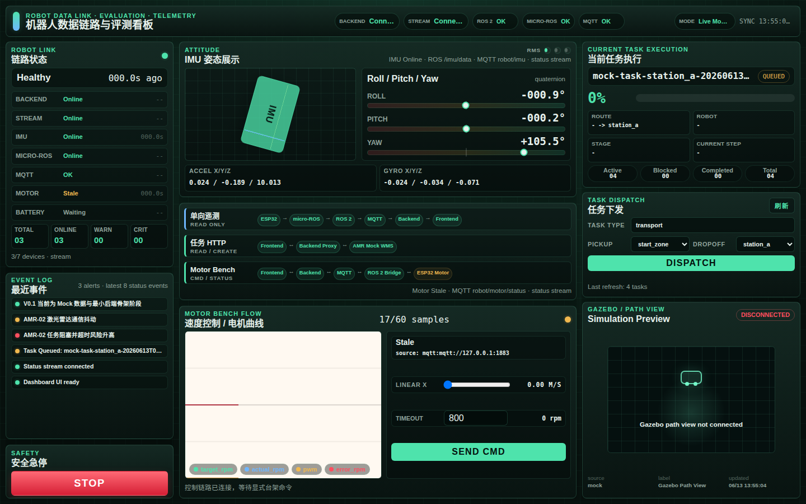
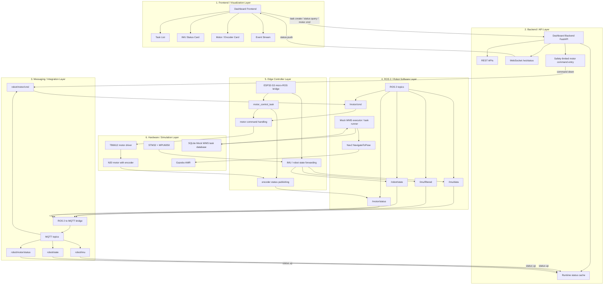

# Robot Data Link & Evaluation Dashboard

## 项目定位

`robot-ops-dashboard` 是一个面向机器人系统的上层运维、数据链路与评测展示驾驶舱，用于聚合任务流、设备状态、告警信息、本地联调入口，以及只读的 baseline / mock evaluation 结果。

它当前重点作为统一观察层，服务以下场景：

- AMR 任务执行进度可视化
- 设备健康与通信状态监控
- 测试验证过程留痕与结果汇总
- 异常告警聚合与排障辅助
- 机器人数据链路、`run_id`、`dataset_version`、`model_version`、失败样本与 compute 状态展示
- 后续 AI 分析结果与诊断建议展示接口预留

## Portfolio Demo / 作品集主入口

本仓库现在作为 **具身智能机器人数据链路与评测平台** 的作品集主入口，用于展示三条已经设计并联调的系统数据链，以及一个明确标注 mock / baseline / reserved 的只读评测展示层：

1. **AMR / WMS 任务链路**：Dashboard frontend -> Dashboard backend -> AMR Mock WMS HTTP API -> Mock WMS executor -> Nav2 / Gazebo -> task status writeback。
2. **IMU / robot state 状态链路**：STM32 + MPU6050 -> ESP32-S3 micro-ROS -> ROS 2 topics -> MQTT mirror -> Dashboard backend -> `/ws/status` -> IMU Status card。
3. **Motor / Encoder bench 链路**：Dashboard explicit command -> `POST /api/robot/motor/cmd` -> MQTT `robot/motor/cmd` -> ESP32 motor bench -> encoder status -> MQTT `robot/motor/status` -> Dashboard。
4. **Data & Evaluation 展示层**：mock evaluation files -> Dashboard backend `GET /api/evaluation/*` -> frontend cards，展示 `run_id`、`dataset_version`、`model_version`、任务成功率、失败样本与 GPU / compute 状态。

作品集提取摘要见 [docs/portfolio_summary.md](./docs/portfolio_summary.md)。机器人数据链路与评测平台说明见 [docs/robot_data_evaluation_platform.md](./docs/robot_data_evaluation_platform.md)。最终 60-90 秒录屏顺序见 [docs/dashboard_demo_storyboard.md](./docs/dashboard_demo_storyboard.md)。

当前展示口径：

- Dashboard 是运维与测试驾驶舱，不是 Nav2 控制台。
- AMR 集成边界保持在 HTTP API 层。
- IMU / robot state 是只读状态镜像。
- Motor bench 只提供低频、受限、显式的本地 bench 命令入口。
- Evaluation 数据只表示 `mock_evaluation`、`baseline_system_evaluation` 或 `interface_reserved`，不宣称已有真实 VLA / RL / world model 训练结果。
- GPU 未接入时必须显示 `not_connected`，不填虚假利用率。
- 前端保持纯 HTML / CSS / JavaScript，不引入前端框架或构建工具。

## Dashboard Preview / 页面预览



更多演示截图：

- [Task Dispatch 画面](./artifacts/screenshots/dashboard-task-dispatch-1440x900.png)
- [1366x768 录屏构图](./artifacts/screenshots/dashboard-recording-frame-1366x768.png)

## Related Repositories / 项目入口

- Main demo portal: [robot-ops-dashboard](./)
  当前仓库，提供统一展示入口，承责任务创建、状态监控、WebSocket 推送、IMU / Motor / Event Stream 可视化。
- AMR navigation core: [amr_warehouse_navigation](https://github.com/inayina/amr_warehouse_navigation)
  基于 ROS 2 Jazzy + Gazebo Harmonic + Nav2 + Mock WMS，负责固定任务点、任务查询 / 创建 / 执行、导航执行和状态回写。
- Embedded digital twin core: [ros2-robot-digital-twin](https://github.com/inayina/ros2-robot-digital-twin)
  基于 STM32 + ESP32-S3 + micro-ROS + ROS 2 + MQTT，负责 IMU、robot state、电机状态与 dashboard 联调链路。

## System Layered Architecture / 系统分层架构

下图从展示入口视角梳理当前系统的自上而下分层关系。`robot-ops-dashboard` 是主展示入口，`amr_warehouse_navigation` 和 `ros2-robot-digital-twin` 是两个核心机器人子系统。



- Frontend / Visualization Layer 负责页面展示，只渲染任务、IMU、电机和事件流，不直接连接 ROS 2、MQTT 或硬件。
- Backend / API Layer 是 dashboard 的观察层和受限交互入口，统一承接 REST、`/ws/status`、状态缓存以及低频受限 motor command。
- Messaging / Integration Layer 负责把 ROS 2 状态镜像到 MQTT，并把 dashboard 发出的受限命令下传到机器人链路，是前后端与机器人子系统之间的集成层。
- ROS 2 / Robot Software Layer 对应两个核心机器人子系统的软件层：AMR 导航侧负责 Mock WMS task runner 和 `Nav2 NavigateToPose`，digital twin 侧负责 IMU、robot state、motor topic 链路。
- Edge Controller Layer 当前以 ESP32-S3 为主，承担 micro-ROS bridge、motor command handling、encoder status publishing；电机控制链路不在 STM32 侧闭环。
- Hardware / Simulation Layer 同时包含真实 bench 硬件和仿真资源：STM32 + MPU6050 提供姿态 / 状态上行，TB6612 + N20 对应电机台架，Gazebo AMR 与 SQLite Mock WMS task database 对应 AMR 演示链路。

## System Data Flow / 系统数据流

下图只展示当前已经存在并完成联调的真实链路，不虚构多机器人调度、完整商业 WMS、AI 诊断闭环或 `ros2_control` 能力。

```mermaid
flowchart TD
  subgraph A["A. AMR Mock WMS 任务链路"]
    A1["Dashboard Frontend"] --> A2["Dashboard Backend FastAPI"]
    A2 --> A3["AMR Mock WMS HTTP API"]
    A3 --> A4["SQLite tasks"]
    A4 --> A5["mock_wms_executor / mock_wms_task_runner"]
    A5 --> A6["Nav2 NavigateToPose"]
    A6 --> A7["Gazebo AMR"]
    A7 --> A8["task status writeback"]
    A8 --> A9["Dashboard task list"]
  end

  subgraph B["B. IMU / robot state 状态上行链路"]
    B1["STM32 MPU6050 / state output"] --> B2["ESP32-S3 micro-ROS bridge"]
    B2 --> B3["ROS 2 topics /imu/data, /imu/filtered, /robot/state"]
    B3 --> B4["ROS 2 to MQTT bridge"]
    B4 --> B5["MQTT topics robot/imu, robot/state"]
    B5 --> B6["Dashboard Backend cache"]
    B6 --> B7["WebSocket /ws/status"]
    B7 --> B8["Dashboard Frontend IMU Status card"]
  end

  subgraph C["C. Motor / Encoder 状态与命令链路"]
    C1["Dashboard Frontend Motor card"] --> C2["POST /api/robot/motor/cmd"]
    C2 --> C3["Dashboard Backend safety limit"]
    C3 --> C4["MQTT robot/motor/cmd"]
    C4 --> C5["ROS 2 /motor/cmd"]
    C5 --> C6["ESP32 motor_control_task"]
    C6 --> C7["TB6612 / N20 motor bench"]
    C7 --> C8["ROS 2 /motor/status"]
    C8 --> C9["MQTT robot/motor/status"]
    C9 --> C10["Dashboard Backend"]
    C10 --> C11["Dashboard Frontend Motor / Encoder card"]
  end
```



## 当前阶段

当前仓库主线仍然是 monitoring-first，但已经包含少量显式交互能力。

建议按以下口径理解本仓库：

- Dashboard 是观察、监控与本地联调入口
- 前端保持纯 HTML / CSS / JavaScript
- Backend 通过 HTTP adapter 读取 AMR API，不直接依赖 ROS 2、Nav2 或 Gazebo
- IMU、robot state 与设备遥测链路保持只读镜像；电机 bench 命令只走显式受限接口
- 集成配置通过环境变量管理，例如 `ROBOT_OPS_TASK_SOURCE`、`AMR_API_BASE_URL`、`MQTT_BROKER_URL`
- 网络失败、上游不可用或 broker 断开时，前端需要明确显示 `disconnected` 或错误状态
- 所有会影响上游或下游行为的动作都必须通过显式 HTTP 接口触发，不能引入隐藏副作用

当前代码已实现的主要能力：

- `GET /health`
- `GET /api/tasks`
- `GET /api/device-status`
- `GET /api/alerts`
- `GET /api/robot/status`
- `GET /api/sim/preview`
- `GET /api/sim/stream`
- `GET /api/wms/tasks`
- `POST /api/wms/tasks`
- `POST /api/robot/motor/cmd`
- `GET /api/evaluation/runs`
- `GET /api/evaluation/datasets`
- `GET /api/evaluation/models`
- `GET /api/evaluation/failure-cases`
- `GET /api/evaluation/compute`
- `GET /api/evaluation/summary`
- `WebSocket /ws/status`
- `ROBOT_OPS_TASK_SOURCE=mock_json|amr_http`

其中：

- `/api/tasks` 用于读取 Dashboard 统一任务视图，可切换 `mock_json` 或 `amr_http`
- `/api/robot/status` 只返回 backend 内存中的 MQTT 最新缓存；broker 不可用时返回 `disconnected` 状态
- `/api/sim/preview` 默认返回 Gazebo 路径预览的 mock 连接状态；配置 `SIM_PREVIEW_MJPEG_URL` 或 `GAZEBO_CAMERA_MJPEG_URL` 后会返回 `/api/sim/stream`
- `/api/sim/stream` 只代理 AMR / Gazebo 侧已暴露的 HTTP MJPEG 字节流，不依赖 ROS 2、Gazebo、RViz、OpenCV 或系统桌面环境
- `/api/wms/tasks` 是对上游 Mock WMS `/tasks` 的最小 HTTP proxy，支持任务查询与创建
- `/api/robot/motor/cmd` 会把前端命令规范化后发布到 MQTT `robot/motor/cmd`，用于低频受限电机控制
- `/api/evaluation/*` 是作品集 Data & Evaluation Layer 的只读接口，只读取 `mock/` 与 `backend/data/eval_runs/` 下的 baseline / mock / reserved 数据
- `/api/evaluation/summary` 返回 `backend/data/eval_runs/sample_eval_run.json` 的轻量核心摘要
- `/ws/status` 向前端推送任务、设备、IMU 和电机状态快照
- 前端首屏实时监控区固定展示 `System Health`、`AMR Task Status`、`IMU Status`、`Motor / Encoder`、`Event Stream`
- 前端首屏下方的 `Evaluation & ML-ready Data Layer` 面向作品集截图组织为 Hero、纵向数据流程、三张摘要卡和 Current Scope 标注，展示 `run_id`、`dataset_version`、`model_version`、`policy_type`、任务成功率、质量检查和 ML-ready feature 字段；当 evaluation API 不可用时使用 `Offline / Mock` fallback，不白屏

## 第一阶段优先级

当前首要目标是把 AMR 任务流、任务状态、设备状态和基础告警链路稳定为可观察、可演示、可验证的监控链路。

后续扩展方向仍保留为：

- 扩展 `ros2-robot-digital-twin` 项目的 MQTT / micro-ROS 下位机状态数据映射
- 引入机器学习异常分类、LLM 诊断建议、YOLO 视觉检测结果展示

## Demo Artifacts / 演示素材

作品集素材统一放在 `artifacts/` 下：

- [artifacts/screenshots](./artifacts/screenshots/)：Dashboard 总览、任务下发、IMU 状态、Motor / Encoder bench、断连状态截图。
- 建议使用 `dashboard-evaluation-platform-1440x900.png` 展示完整 `Evaluation & ML-ready Data Layer`；后端未启动时可额外截取 `dashboard-disconnected-evaluation-1440x900.png`，保留右上角 `Offline / Mock` fallback 标注。
- [artifacts/videos](./artifacts/videos/)：60-90 秒演示录屏和最终剪辑版本。
- [artifacts/reports](./artifacts/reports/)：录屏前彩排、HTTP API 验证、MQTT topic 采样和测试报告。

基于已有 Playwright 的素材采集命令：

```bash
npm run capture:screenshots
npm run capture:video
```

默认采集脚本只做页面截图和只读录屏，不会创建 WMS task，也不会下发 motor command。需要录制完整交互时显式开启：

```bash
node scripts/capture_dashboard_artifacts.js --dispatch --motor-demo --record-ms 75000
```

录屏前建议先完成 [docs/recording_rehearsal_checklist.md](./docs/recording_rehearsal_checklist.md)，再按 [docs/dashboard_demo_storyboard.md](./docs/dashboard_demo_storyboard.md) 录制最终版本。

## Frontend Live Demo / 本地演示入口

本节记录当前代码已实现的本地演示路径，覆盖状态监控、Mock WMS task 创建和受限电机控制。

联调时最容易混淆的是端口角色。当前默认口径固定如下：

| 服务 | 默认地址 / 端口 | 作用 |
| --- | --- | --- |
| AMR Mock WMS API | `http://127.0.0.1:8000` | 上游任务 HTTP API，仅在 `ROBOT_OPS_TASK_SOURCE=amr_http` 时使用 |
| Frontend static server | `http://127.0.0.1:8001/frontend/` | 静态页面入口 |
| MQTT broker | `mqtt://127.0.0.1:1883` | `robot/imu`、`robot/state`、`robot/motor/status`、`robot/motor/cmd` |
| micro-ROS Agent UDP | `udp4://0.0.0.0:8888` | ESP32-S3 -> ROS 2 数据接入 |
| Dashboard backend | `http://127.0.0.1:9000` | `/api/*` 与 `/ws/status` |

记忆方式：

- `8001` 只给浏览器打开前端，不是 API 端口。
- `9000` 才是 frontend 默认请求的 backend API / WebSocket。
- `1883` 是 broker，不直接给浏览器访问。
- `8888` 是 micro-ROS UDP Agent，不是 HTTP 端口。

V0.2 前端演示页支持状态监控与最小 Mock WMS 任务创建，推荐按下面顺序启动：

1. `AMR Mock WMS API` at `127.0.0.1:8000`
   确保上游仓库已经启动，并能访问 `GET /health` 与 `GET /tasks`。
2. `Dashboard backend` at `127.0.0.1:9000`

```bash
source .venv/bin/activate
export ROBOT_OPS_TASK_SOURCE=amr_http
export AMR_API_BASE_URL=http://127.0.0.1:8000
# 可选：AMR / Gazebo 侧已经提供了可看到路径的 MJPEG 预览流时启用
# export SIM_PREVIEW_MJPEG_URL=http://127.0.0.1:8080/stream
uvicorn backend.app.main:app --host 127.0.0.1 --port 9000 --reload
```

3. `frontend static server` at `127.0.0.1:8001/frontend/`

```bash
python3 -m http.server 8001
```

浏览器访问：

- `http://127.0.0.1:8001/frontend/`

说明：

- Frontend 默认请求 `http://127.0.0.1:9000/api/tasks`
- Frontend 默认连接 `ws://127.0.0.1:9000/ws/status` 接收状态流
- Frontend 通过 `POST /api/wms/tasks` 创建 Mock WMS task，并通过 `GET /api/wms/tasks` 手动刷新 WMS 任务列表
- Frontend 通过 `GET /api/sim/preview` 每 3 秒刷新右侧 `Simulation Preview` 小监控窗；未配置预览流时，占位画面显示 `Gazebo path view not connected`
- 如果 backend 配置了 `SIM_PREVIEW_MJPEG_URL` 或 `GAZEBO_CAMERA_MJPEG_URL`，`/api/sim/preview` 会返回 `/api/sim/stream`，前端 `` 自动切换到真实的 Gazebo / RViz 路径预览 MJPEG 画面
- 当使用 `./scripts/start_dashboard_api_stack.sh --with-amr-visualization` 且未手工提供预览 URL 时，脚本会默认抓取本机 RViz path 视图，并把它接到这个小监控窗
- Frontend 每 3 秒保留 HTTP 自动刷新 fallback，便于录屏时观察新任务和状态变化
- 这是 **Mock WMS + Motor Bench demo**，不提供 Nav2 控制，但提供受限的 dashboard -> backend -> MQTT 电机命令联调入口
- Simulation Preview 接入设计见 [docs/gazebo_camera_mjpeg_stream_design.md](./docs/gazebo_camera_mjpeg_stream_design.md)。Dashboard 不直接嵌入 RViz，不做 noVNC，不做 WebRTC。

### 一键启动本地 API 和页面

如果只想启动 API 和 Dashboard 页面，不想自动执行 AMR 任务，请使用：

```bash
./scripts/start_dashboard_api_stack.sh
```

如果已经有 Gazebo / AMR 侧的 MJPEG HTTP URL，也可以直接把它带进启动脚本：

```bash
./scripts/start_dashboard_api_stack.sh \
  --sim-preview-url "http://127.0.0.1:8080/stream"
```

它会启动或复用：

- AMR Mock WMS API：`http://127.0.0.1:8000`
- Dashboard backend：`http://127.0.0.1:9000`
- Frontend 静态页面：`http://127.0.0.1:8001/frontend/`

这个脚本不会调用 AMR visual demo，不会自动创建或执行任务。
如果 9000 端口已有 Dashboard backend，但当前 mode 不是 `amr_http`，或 `/api/tasks` 的 `source` 不匹配当前 `AMR_API_BASE_URL`，脚本会直接报错，避免页面误读旧数据源。
如果你传了 `--sim-preview-url`，或环境变量 `SIM_PREVIEW_MJPEG_URL` / `GAZEBO_CAMERA_MJPEG_URL`，脚本还会校验当前 backend 的 `Simulation Preview` 配置是否一致，避免复用到没带预览配置的旧服务。

如果希望在 Dashboard 页面创建任务后，能在 AMR 仓库的 Gazebo/RViz 可视化里看到执行过程，请使用：

```bash
./scripts/start_dashboard_api_stack.sh --with-amr-visualization
```

这个模式会额外启动或复用：

- AMR `navigation.launch.py`
- Gazebo / RViz 可视化
- 本地 `RViz -> MJPEG` 路径预览桥接
- AMR HTTP executor loop

如果你没有手工传 `--sim-preview-url`，这个模式会默认起一个本地 MJPEG 服务，抓取 RViz 中带 path 的导航视图，并自动接到 Dashboard 右侧 `Simulation Preview`。
为避免某些 OpenGL / RViz 窗口在 `x11grab` 下出现黑帧，本地 `window` 模式默认走 X11 `xwd` 截图再转 MJPEG。

然后你在 Dashboard 页面创建 Mock WMS task 后，executor 会通过 `AMR_API_BASE_URL/tasks` 轮询并消费 pending task，向 Nav2 发送 `NavigateToPose`。它不会自动创建任务，任务仍然由页面或 curl 创建。

常用命令：

```bash
# 查看探测状态
./scripts/start_dashboard_api_stack.sh --status

# 启动 API、页面、AMR 可视化和 executor，但不自动创建任务
./scripts/start_dashboard_api_stack.sh --with-amr-visualization

# 复用已经启动的 AMR navigation.launch.py
./scripts/start_dashboard_api_stack.sh --with-amr-visualization --skip-nav-launch

# 只启动执行链路但不打开 Gazebo GUI / RViz
./scripts/start_dashboard_api_stack.sh --with-amr-visualization --headless

# 停止由该脚本启动的服务
./scripts/start_dashboard_api_stack.sh --stop

# 只启动 AMR API 和 Dashboard backend，不启动 frontend
./scripts/start_dashboard_api_stack.sh --no-frontend
```

## Mock WMS Task Create Verification

验证顺序：

1. 启动 AMR HTTP API，确保可访问：

```bash
curl --noproxy '*' http://127.0.0.1:8000/health
curl --noproxy '*' http://127.0.0.1:8000/tasks
```

2. 启动 Dashboard backend：

```bash
source .venv/bin/activate
export AMR_API_BASE_URL=http://127.0.0.1:8000
uvicorn backend.app.main:app --host 127.0.0.1 --port 9000 --reload
```

3. 启动 frontend：

```bash
python3 -m http.server 8001
```

4. 打开页面并创建任务：

- `http://127.0.0.1:8001/frontend/`
- 在 `Mock WMS` 区域选择 `pickup`、`dropoff`，点击 `创建任务`

5. 用 curl 验证 Dashboard proxy：

```bash
curl --noproxy '*' http://127.0.0.1:9000/api/wms/tasks | python3 -m json.tool
```

6. 验证 Simulation Preview 状态：

```bash
curl --noproxy '*' http://127.0.0.1:9000/api/sim/preview | python3 -m json.tool
```

如需让小监控窗看到 Gazebo / RViz 中的小车路径，先在 AMR / Gazebo 侧准备一个能看到路线、位姿或 path 的 MJPEG 预览流，然后启动 Dashboard backend 时设置：

```bash
export SIM_PREVIEW_MJPEG_URL=http://127.0.0.1:8080/stream
```

此后 `/api/sim/preview` 会返回 `stream_url`，浏览器会自动从 placeholder 切换到 `/api/sim/stream`。如果上游断开，前端回退为 `disconnected` 占位状态；上游恢复后，前端会在后续轮询里自动重试同一条 stream URL。

注意：

- Dashboard 只消费最终的 HTTP MJPEG URL，不负责生成 Gazebo / RViz 预览画面。
- 上游可以提供 Gazebo 顶视图、RViz 中带 path 的 map 视图，或其他能清楚看到小车路径的 MJPEG 流。
- 如果你直接使用 `./scripts/start_dashboard_api_stack.sh --with-amr-visualization`，本仓库会优先尝试自动抓取本机 RViz path 视图，不必额外准备上游 MJPEG 服务。
- 当前如果仿真侧没有合适的预览源，就需要先在上游仓库补一个可见路径的 MJPEG 输出，再把 `SIM_PREVIEW_MJPEG_URL` 或 `GAZEBO_CAMERA_MJPEG_URL` 配到本仓库。

7. 也可以直接通过 Dashboard backend 创建任务：

```bash
curl --noproxy '*' \
  --request POST \
  --header 'Content-Type: application/json' \
  --data '{"task_type":"transport","pickup":"start_zone","dropoff":"station_a"}' \
  http://127.0.0.1:9000/api/wms/tasks | python3 -m json.tool
```

说明：

- Dashboard backend 只把请求转发到 AMR Mock WMS HTTP API，不写数据库。
- `pickup` 当前用于 Dashboard 生成 `task_name` 和前端展示；上游 Mock WMS 当前实际执行目标来自 `dropoff -> target_name`。
- 如果上游拒绝某个目标点，例如当前 AMR Mock WMS 不接受 `start_zone` 作为 target，Dashboard 会返回上游错误。

## MQTT Robot Status And Motor Cmd

本节同时覆盖 MQTT 状态监控链路与当前已实现的 motor command 发布链路。

Dashboard backend 会在启动时尝试连接本地 MQTT broker：

- 默认 broker：`mqtt://127.0.0.1:1883`
- 可覆盖环境变量：`MQTT_BROKER_URL=mqtt://127.0.0.1:1883`
- 订阅 topic：`robot/state`、`robot/imu`、`robot/motor/status`、`robot/alarm`
- 发布 topic：`robot/motor/cmd`
- 缓存位置：backend 进程内存，不写数据库
- HTTP 接口：`GET /api/robot/status`
- HTTP 控制接口：`POST /api/robot/motor/cmd`

推荐启动顺序：

1. 启动本地 MQTT broker，例如：

```bash
mosquitto -p 1883
```

2. 启动 Dashboard backend：

```bash
source .venv/bin/activate
uvicorn backend.app.main:app --host 127.0.0.1 --port 9000 --reload
```

3. 在另一个终端启动 mock motor publisher，用于模拟 `robot_status_api_bridge` 的 `robot/motor/status` 状态镜像：

```bash
source .venv/bin/activate
python3 scripts/mock_mqtt_motor_status_publisher.py --broker mqtt://127.0.0.1:1883 --interval 1
```

验证命令：

```bash
curl --noproxy '*' http://127.0.0.1:9000/api/robot/status | python3 -m json.tool
```

如果安装了 `mosquitto-clients`，也可以观察原始 topic：

```bash
mosquitto_sub -h 127.0.0.1 -t 'robot/#' -v
```

说明：

- `robot/motor/status` 当前对齐 `/home/ina/Documents/PlatformIO/Projects/robot-state-monitor-v1/ros2/robot_mqtt_bridge`：payload 包含 `status`、`target_rpm`、`measured_rpm`、`pwm`、`enabled`、`closed_loop`、`fault`、`motor_state`、`last_update_time`；更新后的 ESP32 bench 固件还会在 `motor_state` 中带出 `hardware_outputs_enabled`。
- `motor_state` 当前仍保留为结构化容错字段，便于前端兼容显示。
- STM32 本地三色传感器状态灯基于 MPU6050 RMS 状态判别输出 `State:<n>`，其中 `0/normal` 表示 Normal，`1/warning` 表示 Warning，`2/alarm` 表示 Alarm，`3/severe/critical` 表示 Critical。
- Dashboard backend 只从 MQTT `robot/state` 的最新缓存读取该状态，并通过 `/api/robot/status` 的 `robot.state` 与 `topics["robot/state"]` 暴露给前端。
- Dashboard 前端在 IMU Status card 内把 robot state 远程映射为 Sensor Status LEDs；该展示仅用于状态观察和现场调试，不控制 STM32/ESP32 或任何硬件 LED。
- Motor / Encoder card 展示的是 **Wheel Speed / 轮端等效速度**，不是 Robot Speed / 整车速度。当前 bench 是 single N20 motor，页面只表示单轮端等效速度。
- Wheel Speed 由 encoder rpm 换算：`wheel_diameter_m = 0.065`，`speed_mps = rpm * Math.PI * wheel_diameter_m / 60`。底层调试仍以 `target_rpm`、`actual_rpm` / `measured_rpm`、`pwm` 为主。
- 如果外部 ESP32 bench 固件已更新到真实 encoder feedback 版本，`/motor/cmd` 常规路径下的 `actual_rpm` / `measured_rpm` 来自单 N20 bench 的编码器滤波值，不再是纯 mock 响应；当前 `20 rpm` 量级通常能接近目标，`40/60/80 rpm` 仍可能有较明显稳态误差。
- 当前 max bench target 是 `80 rpm`，约 `0.27 m/s`；前端 Wheel Speed slider 保守限制为 `0.00 ~ 0.25 m/s`，步进 `0.01 m/s`，拖动只更新 UI，点击 `Apply` 后才下发命令。
- `scripts/mock_mqtt_motor_status_publisher.py` 默认模拟安全录屏 bench profile：`0 -> 40 -> 60 -> 80 -> 50 -> 0 rpm`；80 rpm 目标下实际值约 66 rpm。
- `POST /api/robot/motor/cmd` 只发布低频受限命令，backend 会先约束 `target_rpm`、`target_speed_mps`、`max_pwm`、`timeout_ms`，并保留 `stop` 最高优先级。`Stop` 会下发 `target_speed_mps=0`、`target_rpm=0`、`stop=true`。
- 如果外部 ESP32 bench 固件已更新到运行时 arm/disarm 版本，`enabled=true` 且 `stop=false` 的 `/motor/cmd` 会在板端临时打开真实硬件输出，`stop=true` 或 `enabled=false` 会关闭；不再需要为了单次 bench 联调反复改编译期开关。
- 当前不是完整双轮底盘闭环，不是完整底盘安全控制系统，也不是 ros2_control。
- broker 未启动时，backend 仍可启动，`/api/robot/status` 会显示 MQTT 连接状态为 `disconnected` 或 `connecting`。
- 前端已有 `/ws/status`，收到 MQTT 新消息后 backend 会通过该 WebSocket 推送新的 `dashboard_status` 快照。

### micro-ROS IMU 状态链路

当前 IMU -> Dashboard 的主链路是 micro-ROS，而不是 ESP32 直接 MQTT：

```text
STM32 + MPU6050
  -> UART
  -> ESP32-S3
  -> micro-ROS / Wi-Fi UDP
  -> PC micro-ROS Agent
  -> ROS 2 topics: /imu/data, /imu/filtered, /robot/state
  -> PC ROS 2 -> MQTT bridge
  -> MQTT robot/imu
  -> Dashboard backend
  -> /api/robot/status and /ws/status
  -> Frontend
```

链路说明：

- micro-ROS 是下位机数据进入 ROS 2 的主链路。
- MQTT 只是 PC 端把 ROS 2 IMU topic 低频镜像到 Dashboard 的展示链路。
- `/robot/state` 经 ROS 2 -> MQTT bridge 映射到 `robot/state` 后，Dashboard 才展示 Sensor Status LEDs；如果 bridge 尚未打通或状态超时，前端保持 `Current: No Data` 与灰色状态灯。
- ESP32 当前不直接发布 MQTT，也不需要配置 MQTT broker。
- Dashboard backend 当前可以显式发布 `robot/motor/cmd`，但不下发 `/cmd_vel`，也不承担 Nav2 或底盘控制。

可以使用仓库脚本一键启动 IMU / robot state / motor status / motor cmd 的联调链路：

```bash
./scripts/start_microros_sensor_stack.sh
```

如果 micro-ROS Agent 已经在 `8888` 运行，只想拉起电机 bench 控制链路，可使用电机专用脚本：

```bash
./scripts/start_motor_control_chain.sh
```

该脚本不会启动或抢占 micro-ROS Agent，只会启动或复用：

- MQTT broker：`mqtt://127.0.0.1:1883`
- ROS 2 -> MQTT motor status bridge：`/motor/status` -> `robot/motor/status`
- MQTT -> ROS 2 motor cmd bridge：`robot/motor/cmd` -> `/motor/cmd`
- Dashboard backend：`http://127.0.0.1:9000`
- Frontend 页面：`http://127.0.0.1:8001/frontend/`

常用调试：

```bash
./scripts/start_motor_control_chain.sh --check
./scripts/start_motor_control_chain.sh --status
./scripts/start_motor_control_chain.sh --stop

# 需要显式验证命令发布链路时，发送一次 stop=true 探针
./scripts/start_motor_control_chain.sh --send-stop-probe
```

默认启动不会发任何电机命令；`--send-stop-probe` 会通过 `POST /api/robot/motor/cmd` 发布一次 `stop=true` 安全探针。

默认启动或复用：

- MQTT broker：`mqtt://127.0.0.1:1883`
- micro-ROS Agent：`udp4 --port 8888`
- ROS 2 topic wait：等待 `/imu/data` 或 `/imu/filtered`
- ROS 2 -> MQTT bridge：订阅检测到的 IMU topic，低频发布到 `robot/imu`
- ROS 2 -> MQTT state bridge：订阅 `/robot/state`，发布到 `robot/state`
- ROS 2 -> MQTT motor status bridge：订阅 `/motor/status`，发布到 `robot/motor/status`
- MQTT -> ROS 2 motor cmd bridge：订阅 `robot/motor/cmd`，发布到 `/motor/cmd`
- Dashboard backend：`http://127.0.0.1:9000`
- Frontend 页面：`http://127.0.0.1:8001/frontend/`

常用参数：

```bash
# 如果想固定订阅某个 IMU topic
./scripts/start_microros_sensor_stack.sh --imu-topic /imu/data

# 如果需要临时使用 serial Agent 调试
./scripts/start_microros_sensor_stack.sh --transport serial --dev /dev/ttyACM0

# 查看状态
./scripts/start_microros_sensor_stack.sh --status

# 只做配置自检，不启动进程
./scripts/start_microros_sensor_stack.sh --check

# 停止本脚本启动的进程
./scripts/start_microros_sensor_stack.sh --stop
```

说明：

- 该脚本按 `micro-ROS Agent -> 等待 IMU ROS 2 topic -> IMU/state bridge -> motor bridge -> Dashboard backend -> frontend` 的顺序启动。
- `microros_imu_to_mqtt_bridge.py` 支持两类只读镜像：
  `sensor_msgs/msg/Imu` -> `robot/imu`
  `std_msgs/msg/Int32` -> `robot/state`
- 该脚本不读取串口，不依赖 ESP32 直接 MQTT。
- bridge 默认做低频镜像，避免把高频 IMU 全量压到 Dashboard。
- `robot/state` 会把 `/robot/state` 的 `Int32` 数值镜像为 MQTT payload，例如 `{"state":2,"state_label":"alarm"}`，供 Dashboard Sensor Status LEDs 使用。
- Dashboard backend 仍只消费 MQTT `robot/imu`、`robot/state`，不直接依赖 ROS 2 或 micro-ROS。
- 电机 bridge 实现仍来自外部 digital twin 仓库 `robot_mqtt_bridge`，本仓库脚本只是通过 `ROBOT_MQTT_BRIDGE_SRC_DIR` 把它作为本机联调依赖拉起。
- 如果当前机器暂时不需要电机链路，可在启动脚本里加 `--no-motor-bridge`。
- 只有使用 `--transport serial` 时才需要串口权限；默认 UDP 模式不读取 `/dev/ttyACM0`。
- 日志默认保存在 `/tmp/robot_ops_microros_sensor_stack/`。

## WebSocket Status Stream

Dashboard backend 提供状态 WebSocket 流：

- Endpoint：`/ws/status`
- 方向：Dashboard Backend -> Frontend
- 数据来源：复用 Dashboard backend 既有 HTTP adapter、mock device status 与 MQTT 最新缓存，不让前端直连 AMR API、ROS 2 或 ESP32
- 作用：向前端推送任务列表、机器人状态快照和 MQTT 设备状态更新

消息结构：

```json
{
  "type": "dashboard_status",
  "timestamp": "2026-05-18T10:00:00+00:00",
  "tasks": [],
  "robot": {
    "mqtt": {}
  },
  "motor": {
    "robot_id": "amr-001",
    "status": "ok",
    "actual_rpm": 118.25,
    "motor_state": "{\"target_rpm\":120.0,\"actual_rpm\":118.25,\"error_rpm\":1.75,\"pwm_duty\":0.4,\"direction\":1,\"control_enabled\":1,\"saturated\":0,\"timeout\":0,\"estop\":0,\"fault\":0,\"source\":\"target_rpm\",\"loop\":42}",
    "freshness": {
      "actual_rpm": {
        "topic": "/motor/actual_rpm",
        "status": "ok"
      },
      "motor_state": {
        "topic": "/motor/state",
        "status": "ok"
      }
    },
    "last_update_time": "2026-05-18T10:00:00Z"
  },
  "imu": null
}
```

说明：

- `/api/tasks`、`/api/device-status`、`/api/alerts` 继续保留，验证脚本仍通过 HTTP 验证。
- `motor` 与 `imu` 来自 MQTT 最新缓存；尚未收到对应 topic 时返回 `null`。
- 前端 IMU 区域同时复用 `/api/robot/status` 与 `/ws/status`；按 `robot/imu` 最新 `received_at` 判断 freshness：超过 3 秒显示 `stale`，超过 10 秒显示 `offline`。
- 前端 Motor / Encoder 区域展示 `robot_status_api_bridge` 的 motor 状态镜像；无真实 motor topic 时保留 placeholder / disconnected 状态。
- 如果 `ROBOT_OPS_TASK_SOURCE=amr_http` 且上游 AMR HTTP 临时不可用，`/ws/status` 当前会把 `tasks` 退化为空并在 `robot.error` 标记任务错误，但继续保留 MQTT `imu` / `motor` 遥测，避免硬件联调时把状态流整体清空。
- Motor / Encoder 区域提供受限的 Wheel Speed bench/demo command 入口：frontend 只调用 Dashboard backend HTTP API，不直接连接 MQTT / ROS 2 / ESP32 / TB6612，不直接下发 PWM。

## AMR 四点录屏脚本

如果需要录制“AMR 任务执行 + Dashboard 实时刷新”的完整演示，可以使用仓库内录屏编排脚本：

```bash
chmod +x scripts/run_amr_dashboard_recording_demo.sh
./scripts/run_amr_dashboard_recording_demo.sh
```

默认行为：

- 使用上游 AMR 仓库：`/home/ina/ros2_ws/src/amr_warehouse_sim`
- 使用 Mock WMS 数据库：`/home/ina/ros2_ws/src/amr_warehouse_sim/data/mock_wms.db`
- 确保 Dashboard backend 以 `ROBOT_OPS_TASK_SOURCE=amr_http` 读取 `http://127.0.0.1:8000/tasks`
- 启动或复用前端静态页面：`http://127.0.0.1:8001/frontend/`
- 调用 AMR 仓库已有 visual demo，依次执行 `station_a station_b shelf_1 shelf_2`

录屏前建议先打开：

- `http://127.0.0.1:8001/frontend/`

常用参数：

```bash
# 复用已经启动的 navigation.launch.py 会话
./scripts/run_amr_dashboard_recording_demo.sh --skip-launch

# 不打开 Gazebo GUI / RViz，适合只看 Dashboard
./scripts/run_amr_dashboard_recording_demo.sh --headless

# 只启动/检查 AMR API、Dashboard backend 和前端，不执行任务
./scripts/run_amr_dashboard_recording_demo.sh --no-run-demo

# 指定其它 AMR 仓库或数据库
./scripts/run_amr_dashboard_recording_demo.sh \
  --amr-repo /home/ina/ros2_ws/src/amr_warehouse_sim \
  --db /home/ina/ros2_ws/src/amr_warehouse_sim/data/mock_wms.db
```

注意：

- 该脚本是 **录屏/demo 编排工具**，不是常规 dashboard 测试脚本。
- 任务执行由上游 `amr_warehouse_sim/scripts/run_mock_wms_visual_demo.sh` 完成。
- Dashboard 本身只通过 HTTP API 读取或创建 Mock WMS task，不直接控制 Nav2 或 Gazebo；电机 bench 命令只走 `POST /api/robot/motor/cmd` 这条显式受限链路。
- 如果 8000 端口已有 AMR API 但读取的不是 `data/mock_wms.db`，脚本会直接报错，避免再次出现“测试在跑，但看板盯着另一个数据库”的情况。

## HTTP Integration Verification

在 AMR Mock WMS API 和 Dashboard backend 都已经启动后，可以运行仓库内脚本验证 HTTP 数据映射与 Mock WMS task creation 链路：

```bash
chmod +x scripts/verify_amr_http_integration.sh
./scripts/verify_amr_http_integration.sh
```

默认地址：

- `AMR_API_BASE_URL=http://127.0.0.1:8000`
- `DASHBOARD_API_BASE_URL=http://127.0.0.1:9000`

如需覆盖：

```bash
AMR_API_BASE_URL=http://127.0.0.1:8000 \
DASHBOARD_API_BASE_URL=http://127.0.0.1:9000 \
./scripts/verify_amr_http_integration.sh
```

脚本会依次检查：

1. AMR API `GET /health`
2. Dashboard backend `GET /api/tasks`
3. AMR API `POST /tasks` 创建测试任务
4. Dashboard `/api/tasks` 中是否能看到该任务
5. `source` 是否表示 `amr_http`
6. `source_status=pending` 是否被映射为 `status=queued`

说明：

- 该脚本会创建一条上游 Mock WMS 测试任务，仅用于本地 Mock WMS 验证。
- 不控制 Nav2，不控制电机，不启动浏览器
- 前端展示是否正常仍由人工打开 `http://127.0.0.1:8001/frontend/` 确认

## 项目说明

本仓库负责把 AMR Mock WMS、设备遥测、事件流和本地 bench 联调入口汇聚到一个轻量 Dashboard 中，方便本地开发、演示录屏和测试验证。

当前代码提供两类显式交互能力：

- `POST /api/wms/tasks`：通过 Dashboard backend 创建上游 Mock WMS task
- `POST /api/robot/motor/cmd`：通过 backend 发布低频 MQTT 电机 bench 命令

更完整的当前说明见 [docs/current_scope.md](./docs/current_scope.md)。

## 预期能力

后续版本预计围绕以下几个能力域展开：

1. 任务运维看板：任务状态、异常任务、机器人分配、任务耗时统计
2. 设备状态看板：电池、通信、传感器、底盘、安全模块等状态汇总
3. 测试验证看板：测试批次、回归结果、场景通过率、关键失败点
4. 告警中心：按严重级别聚合系统异常、设备异常和测试异常
5. AI 辅助中心：异常分类、诊断建议、视觉检测结果展示

## 仓库结构

```text
robot-ops-dashboard/
├── README.md
├── PLAN.md
├── docs/
│   ├── design.md
│   ├── roadmap.md
│   ├── api_contract.md
│   ├── data_sources.md
│   ├── dashboard_pages.md
│   ├── robot_data_evaluation_platform.md
│   ├── robot_data_pipeline.md
│   ├── evaluation_dashboard_design.md
│   ├── integration_amr_http.md
│   ├── integration_mqtt_device.md
│   ├── wms_task_proxy_design.md
│   ├── ai_extension_plan.md
│   ├── test_plan.md
│   └── commit_convention.md
├── mock/
│   ├── sample_amr_tasks.json
│   ├── sample_device_status.json
│   ├── sample_alerts.json
│   ├── sample_evaluation_runs.json
│   ├── sample_dataset_versions.json
│   ├── sample_model_versions.json
│   ├── sample_failure_cases.json
│   └── sample_compute_usage.json
├── scripts/
│   ├── mock_mqtt_motor_status_publisher.py
│   ├── run_amr_dashboard_recording_demo.sh
│   ├── start_dashboard_api_stack.sh
│   └── verify_amr_http_integration.sh
├── backend/
│   ├── __init__.py
│   ├── README.md
│   ├── requirements.txt
│   └── app/
│       ├── __init__.py
│       ├── config.py
│       ├── main.py
│       ├── schemas.py
│       └── services/
│           ├── __init__.py
│           ├── amr_http_service.py
│           ├── mqtt_robot_status.py
│           ├── mock_data_service.py
│           └── task_mapper.py
└── frontend/
    ├── index.html
    ├── app.js
    └── styles.css
```

说明：

- `docs/` 用于沉淀设计、范围、接口契约与路线规划
- `mock/` 用于提供前后续开发、联调、演示和只读 evaluation 展示的样例数据
- `backend/` 当前提供最小 FastAPI 后端、AMR HTTP adapter、Mock WMS task proxy 与 MQTT 状态缓存
- `frontend/` 当前用于本地静态监控页面、Mock WMS task 创建与 Data & Evaluation Layer 展示

## 文档导航

- [本次作品集改造计划](PLAN.md)
- [机器人数据链路与评测平台说明](docs/robot_data_evaluation_platform.md)
- [机器人数据链路说明](docs/robot_data_pipeline.md)
- [Evaluation Dashboard 设计说明](docs/evaluation_dashboard_design.md)
- [总体设计](docs/design.md)
- [演进路线](docs/roadmap.md)
- [数据接口契约](docs/api_contract.md)
- [数据源规划](docs/data_sources.md)
- [页面规划](docs/dashboard_pages.md)
- [AMR HTTP 集成方案](docs/integration_amr_http.md)
- [MQTT / micro-ROS 集成方案](docs/integration_mqtt_device.md)
- [WMS 任务下发 Proxy 设计](docs/wms_task_proxy_design.md)
- [AI 扩展规划](docs/ai_extension_plan.md)
- [测试计划](docs/test_plan.md)
- [提交命名规范](docs/commit_convention.md)

## 适合展示的项目描述

如果后续需要用于 GitHub 首页说明或简历描述，可以概括为：

> 面向机器人数据链路、系统 baseline 评测与状态监控的轻量 Dashboard，围绕 `amr_warehouse_navigation` Mock WMS HTTP API、本地 MQTT 状态 topic 与 mock evaluation contract 建立统一展示入口，覆盖 AMR 任务链路、micro-ROS / MQTT 遥测、Motor bench 状态、run_id、dataset_version、model_version、失败样本和 compute 状态；当前不宣称真实 VLA / RL / world model 训练结果。
