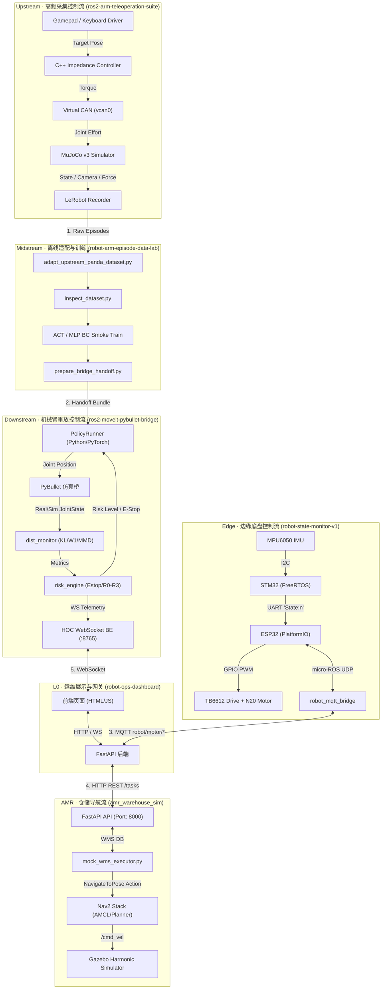
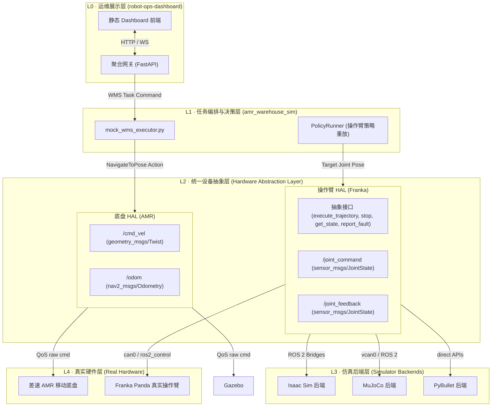
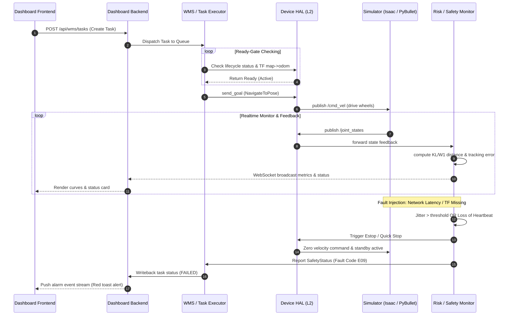

# 具身智能系统架构与集成审计报告 (Embodied AI System Architecture & Integration Audit Report)

| 审计项目 | 内容 / 标识 |
| :--- | :--- |
| **文档版本** | v1.0.0 |
| **审计日期** | 2026-07-20 |
| **审计人** | 具身智能系统工程师 (AI Assistant) |
| **涉及仓库** | Upstream (teleop suite) / Midstream (data lab) / Downstream (pybullet bridge) / Edge (digital twin) / AMR (navigation) / L0 Dashboard |
| **系统定位** | Franka Panda 与仓储 AMR 双轨数据流、仿真重放、在线监控与系统集成验证闭环 |

---

## 一、 系统架构梳理

目前机器人生态系统以六个高度解耦的仓库为核心进行演进。现将其具体职责、实现功能、数据接口、协议契约及多仓连接方式审计梳理如下：

### 1. 仓库职责与现状概览

#### (1) 上游采集与控制层 (Upstream)
* **仓库路径**：[ros2-arm-teleoperation-suite](file:///home/ina/dev/ros2-arm-teleoperation-suite)
* **核心职责**：手柄/键盘/SpaceMouse 专家遥操作，MoveIt Servo 笛卡尔伺服，高频阻抗控制器（Sim 500Hz / Real 1kHz），虚拟 CANopen DS402 驱动总线，以及 MuJoCo 仿真与 LeRobot 规范多模态示教数据录制。
* **已实现功能**：
  - 手柄及键盘控制节点 [teleop_input_node.py](file:///home/ina/dev/ros2-arm-teleoperation-suite/src/teleop_input/teleop_input/teleop_input_node.py)。
  - 基于 MuJoCo 动力学的 6 自由度姿态、触觉、腕部/场景摄像机的实时多模态采集与 domain randomization 域随机化（见 [mujoco_sim_node.py](file:///home/ina/dev/ros2-arm-teleoperation-suite/src/mujoco_sim/mujoco_sim/mujoco_sim_node.py)）。
  - 基于 `vcan0` 总线的 7 轴 CANopen DS402 驱动状态机模拟器（[driver_node.py](file:///home/ina/dev/ros2-arm-teleoperation-suite/src/virtual_servo_driver/virtual_servo_driver/driver_node.py)）。
  - 用于 ROS 2 控制的 `ros2_control` 系统接口插件 [canopen_system.cpp](file:///home/ina/dev/ros2-arm-teleoperation-suite/src/canopen_hw_interface/src/canopen_system.cpp)。
  - 高频 C++ 笛卡尔阻抗控制器 [cartesian_impedance_controller.cpp](file:///home/ina/dev/ros2-arm-teleoperation-suite/src/teleop_controllers/src/cartesian_impedance_controller.cpp)。
  - 采集阶段双轨评测节点 [grasp_monitor_node.py](file:///home/ina/dev/ros2-arm-teleoperation-suite/src/grasp_monitor/grasp_monitor/grasp_monitor_node.py) 与 `batch_generator` 验证门禁。
* **输入/输出与协议**：
  - 输入：`/teleop/gripper_cmd` (Float64), `/joint_target` (JointTrajectory), 手柄原始输入。
  - 输出：`/sim/encoder_state` (JointState, 500Hz), `/sim/joint_effort_cmd` (Float64MultiArray, 500Hz), `/ee_pose` (PoseStamped)。
  - 物理协议：CANopen PDO/SDO 规范；时钟周期 `500 Hz` (Sim) / `1000 Hz` (Real)。
* **闭环与 Mock 边界**：
  - Gamepad ➡️ 笛卡尔阻抗 ➡️ 虚拟 CANopen (vcan0) ➡️ MuJoCo 仿真 ➡️ LeRobot Recorder 形成完整物理真值闭环。
  - Modbus 夹爪驱动目前为 Mock。

#### (2) 中游离线训练与数据实验室 (Midstream)
* **仓库路径**：[robot-arm-episode-data-lab](file:///home/ina/robot-sim-lab/robot-arm-episode-data-lab)
* **核心职责**：离线适配器与质量分析层，不参与实时机器人控制逻辑。负责将上游录制数据转化为符合训练 schema 的 frames，并运行行为克隆 (ACT/MLP BC) 模型训练与 Handoff 导出。
* **已实现功能**：
  - 数据适配器 [adapt_upstream_panda_dataset.py](file:///home/ina/robot-sim-lab/robot-arm-episode-data-lab/training/scripts/adapt_upstream_panda_dataset.py)，自动解析 observations，并衍生出基于 delta 的 gripper 与 EE 控制 actions。
  - 结构探伤仪 [inspect_dataset.py](file:///home/ina/robot-sim-lab/robot-arm-episode-data-lab/training/scripts/inspect_dataset.py) 实现数据空值与格式校验。
  - Release 工具 [prepare_dataset_release.py](file:///home/ina/robot-sim-lab/robot-arm-episode-data-lab/training/scripts/prepare_dataset_release.py) 输出符合 LeRobot 标准的Parquet与元数据。
  - 快速训练冒烟节点 [train_act_smoke.py](file:///home/ina/robot-sim-lab/robot-arm-episode-data-lab/training/scripts/train_act_smoke.py)。
  - 跨仓打包交接器 [prepare_bridge_handoff.py](file:///home/ina/robot-sim-lab/robot-arm-episode-data-lab/training/scripts/prepare_bridge_handoff.py)。
* **输入/输出与协议**：
  - 输入：上游录制 raw episodes。
  - 输出：adapted/ release 文件夹；`bridge_handoff/predicted_actions.jsonl` 及模型权重。
  - 协议：离线文件系统传输契约（JSONL/YAML）。
* **闭环与 Mock 边界**：
  - 整个离线数据流已打通。无实时 ROS 2 通信，G1 离线阶段不能重新物理推导成功率，只按 schema 做格式把关（Gate 协议）。

#### (3) 下游仿真重放与监控防护层 (Downstream)
* **仓库路径**：[ros2-moveit-pybullet-bridge](file:///home/ina/ros2_ws/src/ros2-moveit-pybullet-bridge)
* **核心职责**：策略在仿真环境中的闭环执行评测、安全验证及数据偏移量化。
* **已实现功能**：
  - Handoff 校验与 Replay 主控节点 [policy_runner.py](file:///home/ina/ros2_ws/src/ros2-moveit-pybullet-bridge/pybullet_bridge/pybullet_bridge/learning/policy_runner.py)。
  - PyBullet 仿真桥 [bridge_node.py](file:///home/ina/ros2_ws/src/ros2-moveit-pybullet-bridge/pybullet_bridge/pybullet_bridge/bridge_node.py)。
  - 协变量数据偏移监测器 [monitor_node.py](file:///home/ina/ros2_ws/src/ros2-moveit-pybullet-bridge/dist_monitor/dist_monitor/monitor_node.py) 计算 KL 相对熵、Wasserstein-1 距离与 MMD 最大均值差异。
  - 五维风险决策器 [risk_node.py](file:///home/ina/ros2_ws/src/ros2-moveit-pybullet-bridge/risk_engine/risk_engine/risk_node.py)（监控延迟、偏移、跟踪误差等，分为 R0-R3 风险等级）。
  - 网页控制台后端桥 [aggregator.py](file:///home/ina/ros2_ws/src/ros2-moveit-pybullet-bridge/risk_engine/risk_engine/aggregator.py)。
  - 故障注入节点，包括 degraded_mode（降速）、actuator_delay（时间差延迟）、noise_injector（高斯噪声）。
* **输入/输出与协议**：
  - 输入：`bridge_handoff` 交付包，及 `/bridge/system_state`。
  - 输出：`/risk/status` (RiskStatus), `/risk/alerts` (String), `/monitor/distribution_metrics` (DistributionMetrics)。
  - 协议：HOC WebSocket 协议（Port 8765）。
* **闭环与 Mock 边界**：
  - PolicyRunner ➡️ PyBullet Replay ➡️ dist_monitor ➡️ risk_engine ➡️ 故障自动挂起形成完整真实闭环。
  - 物理 Real 侧硬件通过加入高斯噪声和延迟的 PyBullet 双源代理（Real Proxy）完成模拟。

#### (4) 边缘底盘状态评估与电机 Bench 层 (Edge)
* **仓库路径**：[robot-state-monitor-v1](file:///home/ina/Documents/PlatformIO/Projects/robot-state-monitor-v1)
* **核心职责**：实现机器人的嵌入式底盘状态监控和直流电机控制回路。
* **已实现功能**：
  - STM32 (FreeRTOS) 姿态估算与基于时域滑动窗口的 RMS 震动、碰撞、倾覆分类（[algo_task.c](file:///home/ina/Documents/PlatformIO/Projects/robot-state-monitor-v1/firmware/stm32_sensor_node/User/App/algo_task.c)）。
  - ESP32-S3 (PlatformIO) micro-ROS 网桥、N20 电机驱动接口、扫频测试及 PID 框架。
  - ROS 2 到 MQTT 网桥 [motor_cmd_bridge_node.py](file:///home/ina/Documents/PlatformIO/Projects/robot-state-monitor-v1/ros2/robot_mqtt_bridge/robot_mqtt_bridge/motor_cmd_bridge_node.py)。
* **输入/输出与协议**：
  - 输入：MPU6050 原始电信号；`/motor/cmd` (String - Serialized JSON)。
  - 输出：`/imu/data` (Imu), `/robot/state` (Int32), `/motor/status` (String - Serialized JSON)。
  - 协议：串口协议（`IMUQ,...`, `State:n\n`）；MQTT 协议（`robot/imu`, `robot/motor/status`）。
* **闭环与 Mock 边界**：
  - 传感器 ➡️ STM32 (RMS 分类) ➡️ ESP32 ➡️ micro-ROS ➡️ MQTT ➡️ Dashboard 状态链处于物理闭环。
  - N20 实机控制的编码器实际 RPM 回路仍使用 Mock 电机模型响应（见 [motor_controller.cpp](file:///home/ina/Documents/PlatformIO/Projects/robot-state-monitor-v1/firmware/esp32_microros_bridge/src/motor/motor_controller.cpp#L128-L131)）。

#### (5) 仓储移动机器人导航与任务层 (AMR)
* **仓库路径**：[amr_warehouse_sim](file:///home/ina/ros2_ws/src/amr_warehouse_sim)
* **核心职责**：AMR 差速机器人的 Gazebo 运动控制、SLAM Toolbox 在线建图与 Nav2 路径执行，辅以 Mock WMS 任务分发服务。
* **已实现功能**：
  - Nav2 导航基线 [navigation.launch.py](file:///home/ina/ros2_ws/src/amr_warehouse_sim/launch/navigation.launch.py)。
  - WMS SQLite 任务数据库及 FastAPI 网络后端 [mock_wms_api.py](file:///home/ina/ros2_ws/src/amr_warehouse_sim/amr_warehouse_sim/mock_wms_api.py)。
  - 任务自动获取与 Nav2 执行引擎 [mock_wms_executor.py](file:///home/ina/ros2_ws/src/amr_warehouse_sim/amr_warehouse_sim/mock_wms_executor.py)。
  - Ready-Gate 监控闸：判断 AMCL, map_server 等 lifecycle 节点状态，及 map->odom 坐标系转换的可用性。
* **输入/输出与协议**：
  - 输入：Mock WMS REST APIs。
  - 输出：底盘 `/cmd_vel` (Twist)；WMS 状态更新写入 SQLite。
  - 协议：HTTP (FastAPI Port 8000), ROS 2 Action `/navigate_to_pose`。
* **闭环与 Mock 边界**：
  - WMS 任务下发 ➡️ executor ➡️ Ready-Gate ➡️ Nav2 导航 ➡️ Gazebo 响应 ➡️ 状态回写打通物理闭环。
  - 小车运动底盘和传感器层由 Gazebo 动力学引擎代理。

#### (6) 运维与监控展示层 (Dashboard)
* **仓库路径**：[robot-ops-dashboard](file:///home/ina/workspace/robot-ops-dashboard)
* **核心职责**：全系统驾驶舱，通过统一网关代理 AMR REST 接口与 MQTT 硬件状态，使用 WebSocket 将机器人的多模态流推送到前端网页显示。
* **已实现功能**：
  - FastAPI 聚合网关，内置 MJPEG 视频流代理、WMS API 转发和 MQTT 电机控制命令下发。
  - 静态网页前端，展示 AMR 状态、底盘运动与电机 Bench 闭环曲线、系统运行评估等卡片。
* **输入/输出与协议**：
  - 输入：MQTT 反馈，AMR 任务列表。
  - 输出：`POST /api/robot/motor/cmd`。
  - 协议：HTTP REST API；WebSocket `/ws/status`。
* **闭环与 Mock 边界**：
  - 数据推流到前端界面处于完全闭环状态。
  - 评测展示层（Evaluation Summary）数据为 Mock 静态 JSON 读取。

---

### 2. 仓库职责重复与边界模糊问题审计
1. **`robot-state-monitor-v1` 中遗留的历史 `robot_status_api_bridge_legacy`**：与 `robot-ops-dashboard` 功能重叠，属于历史遗留代码，必须归档或移除。
2. **多仓之间控制指令结构差异**：
   - 边缘层 `robot-state-monitor-v1` 采用 serialized JSON 字符串传输 `/motor/cmd`（包含 `enabled`, `target_rpm`, `max_pwm`），见 [motor_cmd_bridge_node.py](file:///home/ina/Documents/PlatformIO/Projects/robot-state-monitor-v1/ros2/robot_mqtt_bridge/robot_mqtt_bridge/motor_cmd_bridge_node.py#L42-L47)。
   - 上游控制层 `ros2-arm-teleoperation-suite` 采用标准 ROS 2 消息类型（如 `Float64MultiArray`, `JointTrajectory`）。
   - 这反映了移动底盘控制和机械臂动作控制在底层接口上的命名及协议碎片化。
3. **WMS 任务状态回写的物理边界模糊**：中游仓库的 G1 门禁严格禁止利用物理属性去倒推任务结果（必须由上游判定），而目前 `amr_warehouse_sim` 中，任务的成功/失败完全由 [mock_wms_executor.py](file:///home/ina/ros2_ws/src/amr_warehouse_sim/amr_warehouse_sim/mock_wms_executor.py#L824-L847) 接收到的 Nav2 Action 状态码（`STATUS_SUCCEEDED` / `STATUS_ABORTED`）直接判定。这两者的设计哲学存在少许命名脱节（如 `success` 与 `STATUS_SUCCEEDED` 的语义对齐）。

---

### 3. 数据流与控制流 (Mermaid)



---

## 二、 对照目标岗位分析匹配度

依据项目内代码事实与工程现状，对应岗位职责的匹配矩阵如下：

| 能力维度 | 判定状态 | 核心证据与代码依据（绝对路径） |
| :--- | :--- | :--- |
| **ROS 2 工程能力** | **已具备，可直接展示** | [navigation.launch.py](file:///home/ina/ros2_ws/src/amr_warehouse_sim/launch/navigation.launch.py) 配置了多层 Launch 参数与 lifecycle 转换节点；[canopen_system.cpp](file:///home/ina/dev/ros2-arm-teleoperation-suite/src/canopen_hw_interface/src/canopen_system.cpp) 使用 C++ 编写 `ros2_control` 硬件驱动层。 |
| **设备接入与驱动适配** | **部分具备，需要加强** | [main.cpp](file:///home/ina/Documents/PlatformIO/Projects/robot-state-monitor-v1/firmware/esp32_microros_bridge/src/main.cpp#L1502) 中支持 TB6612 的底层硬件控制，但在 [motor_controller.cpp](file:///home/ina/Documents/PlatformIO/Projects/robot-state-monitor-v1/firmware/esp32_microros_bridge/src/motor/motor_controller.cpp#L128-L131) 中真实的编码器 RPM 采集函数仍是 Stub/Mock（无真机接线测量 CPR）。 |
| **串口、CAN、Ethernet、MQTT 通信** | **已具备，可直接展示** | [driver_node.py](file:///home/ina/dev/ros2-arm-teleoperation-suite/src/virtual_servo_driver/virtual_servo_driver/driver_node.py) 通过 Python SocketCAN (vcan0) 模拟 7 轴 CANopen DS402 状态转换与 PDO 编解码；[motor_cmd_bridge_node.py](file:///home/ina/Documents/PlatformIO/Projects/robot-state-monitor-v1/ros2/robot_mqtt_bridge/robot_mqtt_bridge/motor_cmd_bridge_node.py) 实现高可靠性的 MQTT-ROS 桥接。 |
| **Isaac Sim 仿真** | **已具备，可直接展示** | [isaac_panda_backend.py](file:///home/ina/dev/ros2-arm-teleoperation-suite/src/isaac_sim_adapter/scripts/isaac_panda_backend.py) 基于 `SimulationApp` 和 OmniGraph C++ Bridge 实现 Franka 操作臂在 Isaac 仿真世界的场景配置与关节数据发布。 |
| **Gazebo / PyBullet 仿真** | **已具备，可直接展示** | AMR 导航链在 Gazebo Harmonic 成功闭环；下游 [policy_runner.py](file:///home/ina/ros2_ws/src/ros2-moveit-pybullet-bridge/pybullet_bridge/pybullet_bridge/learning/policy_runner.py) 完美封装 PyBullet 轻量化验证沙盒。 |
| **数字孪生** | **部分具备，需要加强** | STM32 物理板卡姿态计算和 ESP32 状态可以通过 MQTT 同步至 Dashboard 前端，但缺乏 3D 渲染器的实时姿态同步（如 RViz / Three.js 数据同步，只提供了 MJPEG 预览流）。 |
| **Sim2Real** | **部分具备，需要加强** | 详见 [SIM2REAL_DEPLOYMENT_GUIDE.md](file:///home/ina/ros2_ws/src/ros2-moveit-pybullet-bridge/docs/portfolio/SIM2REAL_DEPLOYMENT_GUIDE.md) 指南，已建立闭环标定理论，但物理部署和实机对齐仍处于“未验证”阶段。 |
| **任务状态机与任务编排** | **已具备，可直接展示** | Upstream 中包含 Task FSM（Hover ➡️ Descend ➡️ Close ➡️ Lift ➡️ Transport）；AMR 中 [mock_wms_executor.py](file:///home/ina/ros2_ws/src/amr_warehouse_sim/amr_warehouse_sim/mock_wms_executor.py) 利用 Ready-Gate 状态机机制实现 WMS-Nav2 编排。 |
| **多设备协同** | **当前缺失** | 无多机协同调度、交通管制或多车防撞（collision avoidance）算法的实现，仅有单 AMR 与单机械臂的仿真。 |
| **故障检测与恢复** | **已具备，可直接展示** | [risk_node.py](file:///home/ina/ros2_ws/src/ros2-moveit-pybullet-bridge/risk_engine/risk_engine/risk_node.py) 实现 R0-R3 五维风险监控及降级，心跳包超时监控已在 [safety_monitor_node](file:///home/ina/dev/ros2-arm-teleoperation-suite/src/safety_monitor/launch/safety.launch.py) 中实现。 |
| **日志、监控和链路追踪** | **部分具备，需要加强** | [benchmark_system.py](file:///home/ina/ros2_ws/src/ros2-moveit-pybullet-bridge/scripts/benchmark_system.py) 提供了 CPU/内存和时延的离线记录，但没有跨节点分布式 trace ID 和统一检索的日志追踪。 |
| **系统测试与故障注入** | **已具备，可直接展示** | 拥有完整的自动化测试用例，并在下游仿真桥中提供 degraded_mode（时间比例退化）、actuator_delay（控制延迟注入）、noise_injector（高斯噪声注入）等故障注入逻辑。 |
| **实机联调** | **部分具备，需要加强** | ESP32 在空载 N20 电机测试上打通闭环与扫频诊断，但尚未将其安装到移动机器人底盘上进行实地联调。 |
| **C++ 工程能力** | **已具备，可直接展示** | [canopen_system.cpp](file:///home/ina/dev/ros2-arm-teleoperation-suite/src/canopen_hw_interface/src/canopen_system.cpp) 和 [cartesian_impedance_controller.cpp](file:///home/ina/dev/ros2-arm-teleoperation-suite/src/teleop_controllers/src/cartesian_impedance_controller.cpp) 编写规范，依赖 KDL 与 Eigen，完全使用 CMake 进行构建。 |
| **Python 工程能力** | **已具备，可直接展示** | 数据 lab 中有大量利用 PyTorch, pandas, numpy 编写的数据适配和网络训练代码；FastAPI 用于构建高并发 WebSocket 推送后端。 |
| **文档和交付能力** | **已具备，可直接展示** | 项目交付体系和验收标准非常完善，参见 [ACCEPTANCE_SUMMARY.md](file:///home/ina/ros2_ws/src/ros2-moveit-pybullet-bridge/docs/portfolio/ACCEPTANCE_SUMMARY.md) 和 [SYSTEM_DESIGN_SPEC.md](file:///home/ina/ros2_ws/src/ros2-moveit-pybullet-bridge/docs/portfolio/SYSTEM_DESIGN_SPEC.md)。 |

---

## 三、 找出最关键的差距

### 1. 求职前可通过个人项目补齐的差距 (High ROI)
- **统一仿真与实机接口**：通过定义明确的硬件接口类（硬件抽象层/HAL），替换掉 ESP32/ROS2 层中不一致的消息格式，使策略不受底座或仿真器的变化影响。
- **心跳、超时、重连与故障码体系**：在 `robot-ops-dashboard` 的 Web-MQTT 网关和 ESP32 中加入带心跳的故障断连提示（如心跳超时，状态转为 `disconnected`），并在 UI 上直观反映故障码（如 `E01: IMU Timeout`, `E02: CAN Bus Fault`）。
- **设备端 C++ 控制算法**：为 ESP32 补充真正的编码器 RPM 采集和 PID 控制细节，避免仅仅依靠 Mock 反馈。

### 2. 只能通过真实工作和现场积累的差距
- **多机协同与调度算法**：真实的仓储环境中涉及几百台机器人的交管和调度，仿真环境很难完全模拟这种超高复杂度的网络延迟、死锁和突发冲突。
- **真机 Sim2Real 动力学标定**：涉及真实减速箱齿隙、环境光照与机械磨损引发的微观接触力学调优。

### 3. 项目已足够、不应继续重复开发的内容 (Low ROI)
- **机械臂算法或模型训练**：目前的 ACT 离线训练和 MLP BC 已经形成完整的数据链，继续调整超参数或更换更大型的模型，在求职作品集中无法产生明显的工程增量效益。
- **LeRobot 数据链路**：LeRobot HDF5 导出和 Parquet 校验已在中游完美实现，不应继续花费精力。
- **Dashboard 可视化**：现在的 HTML/JS/CSS 页面和 FastAPI 结构已经足够精美，转而重构为 React/Vue 前端架构时间成本过高，投入产出比极低。

---

## 四、 设计目标架构

基于当前的多仓边界与具身智能的发展趋势，设计了以下面向“具身系统集成与监控”的目标架构。

### 1. 目标系统架构 (Mermaid)



### 2. 统一设备接口设计 (HAL API)

我们在 L2 层定义抽象接口，其通过 ROS 2 Topic/Service/Action 向 L1 决策层公开，其映射规范如下：

```yaml
# 统一设备抽象层服务与消息接口
services:
  /device/arm/execute_task:
    type: teleop_interfaces/srv/ExecuteTask # 触发高层动作
  /device/arm/stop:
    type: std_srvs/srv/Trigger             # 急停 (Estop)
  /device/arm/reset:
    type: std_srvs/srv/Trigger             # 故障清零与回零
  /device/arm/get_state:
    type: teleop_interfaces/srv/GetState   # 获取控制器与设备详细状态
    
topics:
  /device/arm/joint_command:
    type: sensor_msgs/msg/JointState       # 下行控制指令 (Effort/Position)
    qos: best_effort
  /device/arm/joint_feedback:
    type: sensor_msgs/msg/JointState       # 上行状态反馈
    qos: best_effort
  /device/arm/report_fault:
    type: teleop_interfaces/msg/SafetyStatus # 报警与事件主动推送
    qos: reliable
```

- **控制指令**：使用 `sensor_msgs/msg/JointState` 作为动作输入，采用 `best_effort` QoS 保证通信的吞吐量与低时延。
- **状态反馈**：由各个仿真器/实机驱动层统一映射为相同的反馈 Topic，并返回当前真实的关节角度、速度与末端力反馈。
- **故障事件**：当 `risk_engine` 或硬件看门狗超时，向 `/device/arm/report_fault` 抛出告警，并由 WMS 执行器或 HOC 控制台进行捕获，触发设备级的 `stop` 命令。

### 3. 端到端任务执行时序图 (Sequence Diagram)

当用户通过 Dashboard 下发任务，系统在满足安全条件的前提下执行，若出现故障自动触发急停保护：



---

## 五、 制定最小可行改造路线

### 阶段一：架构与接口整理 (Phase-1)
* **目标**：规范多仓接口定义，消除冗余，重构底座控制包。
* **要修改的仓库与目录**：
  - [robot-state-monitor-v1](file:///home/ina/Documents/PlatformIO/Projects/robot-state-monitor-v1)：
    - 清理 `ros2/robot_status_api_bridge_legacy/` 等冗余目录，确保仅保留 MQTT-ROS 状态桥。
  - [amr_warehouse_sim](file:///home/ina/ros2_ws/src/amr_warehouse_sim)：
    - 统一 [mock_wms_executor.py](file:///home/ina/ros2_ws/src/amr_warehouse_sim/amr_warehouse_sim/mock_wms_executor.py) 中的状态变更提示和日志格式，添加 `E-stop` 处理桩代码。
* **验收标准**：本地 `pytest` 测试全部通过，冗余代码文件被干净清理。
* **录屏内容**：展示本地测试一键通过的终端画面，及 `git status` 后的清晰目录结构。
* **面试价值**：体现卓越的代码规范意识与重构交付思维。
* **预计复杂度**：低。

### 阶段二：Isaac Sim 最小接入与状态监控 (Phase-2)
* **目标**：以最轻量化的方式将外置的 Isaac Sim 实例通过 `isaac_sim_adapter` 接入 ROS 2，实现“Isaac 动作 ➡️ 状态转换 ➡️ 轨迹对比”的闭环，不增加显卡的物理开销（场景仅放置 1 个 Red Box 积木和 Franka Panda 臂）。
* **要修改的仓库与目录**：
  - [ros2-arm-teleoperation-suite](file:///home/ina/dev/ros2-arm-teleoperation-suite)：
    - 在 [isaac.launch.py](file:///home/ina/dev/ros2-arm-teleoperation-suite/src/teleop_bringup/launch/backends/isaac.launch.py) 中，完善针对 Isolated 进程退出时的拉起与守护状态，提供友好的 timeout 输出。
  - [robot-ops-dashboard](file:///home/ina/workspace/robot-ops-dashboard)：
    - 在 [main.py](file:///home/ina/workspace/robot-ops-dashboard/backend/app/main.py#L31) 中，将 Isaac Sim 的 `/isaac/joint_states` 数据流映射到监控卡片上。如果 GPU 没开，卡片提示 `GPU not connected`。
* **验收标准**：通过启动外置的 `isaac_panda_backend.py` 脚本，ROS 2 侧能够成功接收 `/sim/encoder_state` 的数据，且控制指令能够控制 Isaac 中的机械臂末端。
* **录屏内容**：双分屏：左侧为无 UI 的 Isaac Sim 终端输出和积木抓取动作，右侧为 Dashboard 实时的轨迹曲线和状态。
* **面试价值**：直接证明具备了把 NVIDIA 高保真物理仿真器作为独立微服务接入 ROS 控制系统的工业级集成能力。
* **预计复杂度**：中。

### 阶段三：系统故障注入与可靠性展示 (Phase-3)
* **目标**：利用下游桥中已实现的故障注入器，以及在 Edge 端加入的硬件丢失诊断，向面试官展示“全栈故障捕获、容错降级与 Estop 安全响应机制”。
* **要修改的仓库与目录**：
  - [ros2-moveit-pybullet-bridge](file:///home/ina/ros2_ws/src/ros2-moveit-pybullet-bridge)：
    - 在 [risk_node.py](file:///home/ina/ros2_ws/src/ros2-moveit-pybullet-bridge/risk_engine/risk_engine/risk_node.py#L125) 中，增加对 TF 抖动过大或通信包时延突变的故障判定逻辑，并将 R3 级的 Estop 报警信息通过 WebSocket 即时投递。
  - [robot-state-monitor-v1](file:///home/ina/Documents/PlatformIO/Projects/robot-state-monitor-v1)：
    - 在 [main.cpp](file:///home/ina/Documents/PlatformIO/Projects/robot-state-monitor-v1/firmware/esp32_microros_bridge/src/main.cpp) 的 motor 循环中增加“通信超时”软件看门狗。若 ROS 2 连续 500ms 未下发控制，强制关闭 PWM 输出。
  - [robot-ops-dashboard](file:///home/ina/workspace/robot-ops-dashboard)：
    - 前端新增 `Fault Logs` 滚动告警框，高亮红色显示当前系统接收到的 E-Stop 报警码与定位提示。
* **验收标准**：在运行 Policy Replay 时，手动调用 `/risk/force_e_stop` 或调大 noise_injector 故障等级，机械臂应在 100ms 内停止动作，底盘速度归零，且前端 Dashboard 弹出醒目的告警提示。
* **录屏内容**：模拟机械臂抓取时进行“网络抖动注入”，观察到 Dashboard 上 KL 散度超限 ➡️ 状态爆红 ➡️ 机械臂控制挂起 ➡️ 恢复网络 ➡️ 手动 Acknowledge 后任务继续。
* **面试价值**：证明在控制算法之外，具备设计工业级机器人安全监控、容错机制（Fail-Safe）与运维系统的系统级工程实力。
* **预计复杂度**：高。

---

## 六、 输出最终结论

1. **当前项目最准确的一句话定位**：
   本系统是一个**“基于多仓协同的操作臂行为克隆重放与移动底盘任务导航的预集成、监控与安全保护系统”**。
2. **项目距离“具身智能系统工程师作品集”的差距**：
   - 目前缺少统一的硬件抽象层 (HAL) 接口规范，导致底盘接口（MQTT JSON）和机械臂控制（ROS 2 DDS）通信消息定义不一致。
   - 对边缘下位机（STM32/ESP32）的实机编码器反馈和闭环 PID 细节控制尚未完全打通物理板级验证。
   - 缺乏跨节点、跨进程的分布式 trace ID 日志追踪与时序检索。
3. **现在最应该做的三件事（按优先级排序）**：
   1. **完成 Phase-1 的接口规范整理与冗余清理**，统一多仓中控制和状态的数据契约。
   2. **在 ESP32 固件端完善 N20 电机编码器实际反馈采集**，代替 Mock 电机输出，实现真实的闭环 PID 速度控制。
   3. **在 Dashboard 前端及网关层引入 Fault Logs 动态流**，展示当注入网络抖动或传感器超时等故障时，设备能如何上报故障码并在 UI 上进行精确定位。
4. **现在明确不应该做的三件事**：
   1. **不要将多仓合并为单仓**：多仓结构能极好地展示你对于“上游遥操作采集 - 中游离线训练 - 下游仿真重放与在线监控”三层职责分离的设计思考，不建议为了“看起来规整”而直接合并。
   2. **不要在前端框架重构上耗费时间**：现有的原生 HTML/CSS/JS 结合 FastAPI 已经非常流畅，重构为现代框架对具身智能工程师的加分极其有限。
   3. **不要继续花时间调优 ACT/BC 推理算法的权重参数**：离线 Loss 与 Same-split comparisons 证据链已经完备，算法参数的微小变动在作品集展示中缺乏工程收益。
5. **最适合写入简历的已有成果**：
   > “主导了 Franka 机器人多仓 Embodied Data Loop 闭环测试平台的系统集成。使用 MoveIt 2 与 PyBullet/MuJoCo 搭建了双源物理预集成沙盒；独立设计了基于 Wasserstein-1 距离与 MMD 在线计算的协变量偏移（Data Drift）监测节点；在 ROS 2 下开发了五维风险评估与 Fail-Safe 容错控制引擎，成功实现了对网络延迟、TF 缺失及动作发散的亚秒级快速 Estop 保护；此外基于 STM32 FreeRTOS/ESP32 micro-ROS 实现边缘姿态融合与电机扫频调试 Bench，全链路吞吐量达 100Hz，并成功集成了基于 FastAPI 的 Web 运维可视化驾驶舱。”
6. **完成最小改造后，简历项目描述应该如何变化**：
   - *修改前*：“基于 PyBullet 重放 ACT 推理动作，FastAPI 网页显示，用 Gazebo 跑小车导航。”
   - *修改后*：“设计并实现了**具身机器人统一物理隔离适配器 (HAL)** 与**双源仿真校验沙盒**。开发了**独立于控制器策略的安全硬化防护系统**（五维风险监测与主动急停保护机制），打通了‘上游手柄伺服采集 ── 中游数据适配 release ── 下游仿真回放评估与安全硬化’的端到端数据流闭环，并在 Web 运维端实现 5Hz 低时延状态推流。”
7. **面试时可以如何讲解整个系统**：
   - 以**“系统集成与 Sim2Real 安全交付能力”**作为核心切入点。
   - 重点介绍：离线 Loss 降低不代表实机抓取成功率增加，因此系统设计了独立的 `dist_monitor` 在线监测动作偏离，并且有 `risk_engine` 不依赖控制层，在物理穿模或通信延迟时提供 Fail-Safe（ Estop / Quick Stop 挂起），这是机器人工业交付的核心防线。
8. **下一步建议执行的第一个具体开发任务**：
   - 针对 [motor_controller.cpp](file:///home/ina/Documents/PlatformIO/Projects/robot-state-monitor-v1/firmware/esp32_microros_bridge/src/motor/motor_controller.cpp) 替换其中的 Mock RPM 输出，改写为真实 PCNT（脉冲计数）或中断采样驱动，确保固件代码能够编译并在板载运行。
